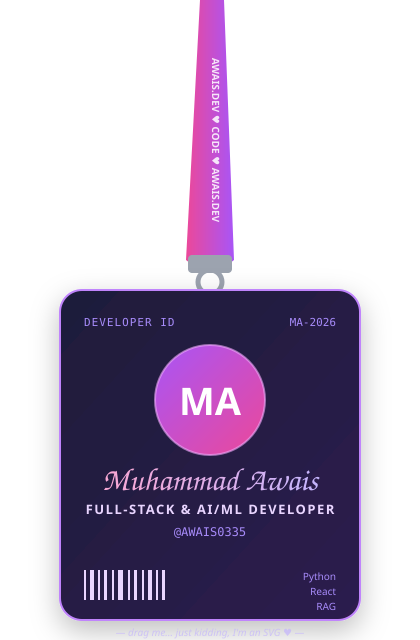
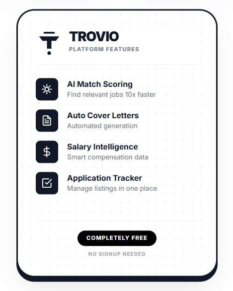
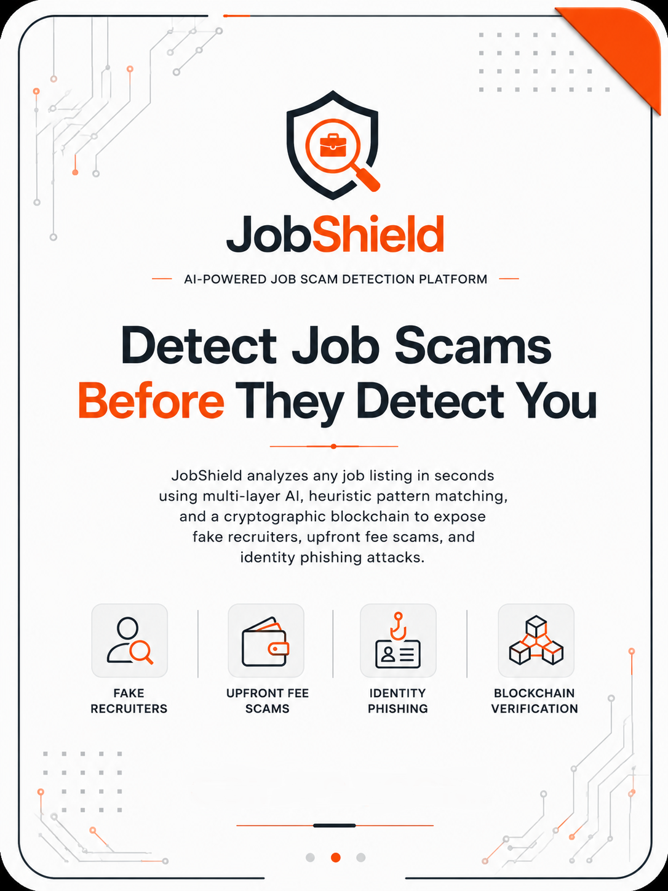
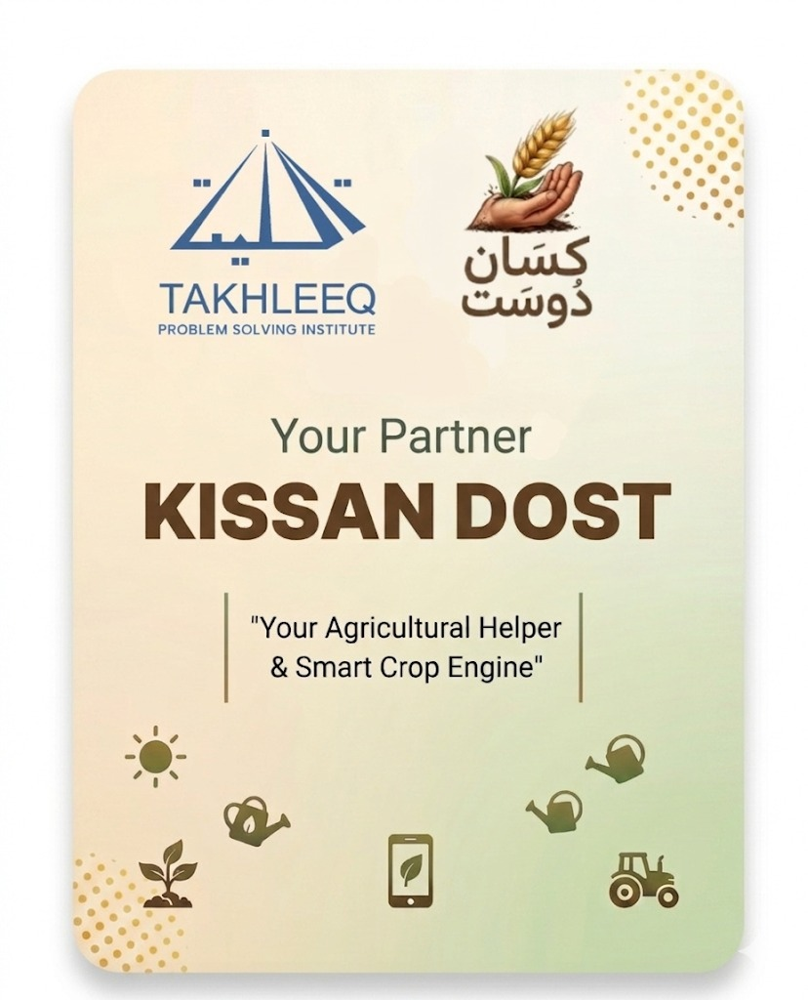
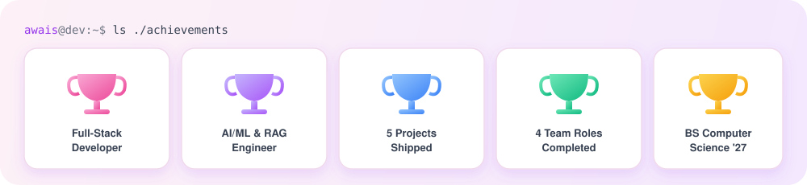

 

### 👋 About Me

- 🚀 Currently building **Kissan Dost**, **Trovio**, and **Medibot** → [devxyn.com](http://devxyn.com/)
- 🧠 Currently learning **AI / Machine Learning** and deepening my RAG pipeline skills
- 🤝 Open to collaborating on **SaaS products** and **AI Automation** projects
- 🎓 BS Computer Science @ University of Central Punjab (UCP) — Expected 2027
- 💼 Currently: **AI/ML Engineering Intern @ CarbonRepro** (US-based, Remote) — working on a medical RAG AI agent
- 📫 Reach me at **muhammadawaisghafoor98@gmail.com**
- 🌐 All projects: [awais.devxyn.com](https://awais.devxyn.com/)

 

### 🛠️ Tech Stack

**Languages**
 

 
**Frontend**
 

 
**Backend & APIs**
 

 
**AI / ML**
 

 
**Databases**
 

 
**Tools & Design**
 

 
## 🚧 Featured Projects
<table>
<tr>
<td width="50%" valign="top">

### 🎯 Trovio — AI-Powered Career Intelligence Platform
Job search aggregator pulling live listings from **16+ platforms** into one unified interface, with AI resume match scoring, a skill-demand radar, and AI-generated cover letters.

`Python` `React.js` `API Integrations` `AI/ML`

</td>
<td width="50%" valign="top">

### 🛡️ JobShield — AI-Powered Job Scam Detection
Analyzes job listings in seconds via a multi-layer AI + heuristic pattern-matching pipeline, with blockchain verification to expose fake recruiters and scams.

`Python` `AI/ML` `React.js` `NLP` `Model Training`

</td>
</tr>
<tr>
<td width="50%" valign="top">

### 🩺 Medi-Health Guide — AI/ML, RAG, NLP
Health-focused AI chatbot agent supporting patients and general users with health-related queries, built with clear CTAs and an SEO-friendly structure.

`RAG` `NLP` `AI Agents`

</td>
<td width="50%" valign="top">

### 🌾 Kissan Dost — Digital Revolution for Farmers
Collaborated at: [takhleeq.co](https://takhleeq.co/)  
Empowering farmers with accurate information, solving daily agricultural problems, and eliminating middleman exploitation to boost Pakistan's agriculture. 

Currently building — check [devxyn.com](http://devxyn.com/) for updates.

`Python` `React.js`

</td>
</tr>
<tr>
<td width="50%" valign="top">
</tr>
</table>

## 💼 Experience

- **Lead Full-Stack Developer — RAG & SaaS Solutions Engineer**, Fiverr (Remote) — *Present*
- **AI/ML Engineering Intern**, CarbonRepro (US-based, Remote) — *Jun 2026 – Present*
- **AI/ML Engineering Intern**, Developers Hub (Remote) — *Apr 2026 – Jun 2026*
- **Frontend Web Development Intern**, DevXcript (Remote) — *Sep 2025 – Nov 2025*

 

## 📊 GitHub Stats

 

## 🏆 Achievements
 

 
**Thanks for stopping by — let's build something great together! 💜**
 

