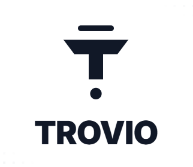
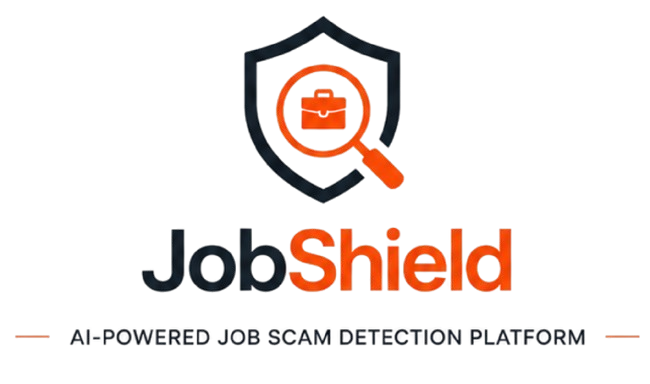

<div align="center">

# Muhammad Awais

### Full-Stack Developer · AI/ML & RAG Solutions Engineer

Building intelligent solutions, delivering real impact.

<br/>

<a href="https://awais.devxyn.com/">
  
</a>
&nbsp;
<a href="mailto:muhammadawaisghafoor98@gmail.com">
  
</a>
&nbsp;
<a href="https://www.linkedin.com/in/muhammadawais98">
  
</a>

</div>

---

## About

I'm a **Computer Science student at the University of Central Punjab** and a Full-Stack Developer focused on **AI/ML, RAG systems, SaaS products, and AI agents**.

I build modern web applications and intelligent software using **Python, FastAPI, React.js, Next.js, Node.js, PostgreSQL, MongoDB, and LLM APIs**.

Alongside my studies, I've gained professional experience through **AI/ML engineering internships, freelance projects, and independent product development**.

Currently, I'm focused on growing as an **AI-focused software engineer** and building practical, scalable products that solve real-world problems.

---

## What I Build

```text
AI / ML
├── RAG-based AI Systems
├── AI Agents
├── NLP Solutions
├── LLM Integrations
└── Model Training & Fine-Tuning

Full-Stack Development
├── SaaS Applications
├── Modern Web Applications
├── REST APIs
├── Backend Systems
└── Responsive Frontend Interfaces

Product Development
├── AI-Powered Products
├── Career Intelligence Platforms
├── Automation Solutions
└── End-to-End MVP Development
```

---

## Tech Stack

### Languages

<p align="left">
  
  &nbsp;
  
  &nbsp;
  
</p>

### Frontend

<p align="left">
  
  &nbsp;
  
  &nbsp;
  
  &nbsp;
  
  &nbsp;
  
</p>

### Backend & APIs

<p align="left">
  
  &nbsp;
  
  &nbsp;
  
  &nbsp;
  
</p>

### AI / ML

<p align="left">

  
  &nbsp;

  <!-- Add your preferred AI/ML provider logos here if desired -->

  
  &nbsp;
  
  &nbsp;
  
  &nbsp;
  

</p>

### AI Platforms & APIs

<p align="left">

  
  &nbsp;
  
  &nbsp;
  
  &nbsp;
  

</p>

### Databases

<p align="left">
  
  &nbsp;
  
  &nbsp;
  
  &nbsp;
  
</p>

### Tools

<p align="left">
  
  &nbsp;
  
  &nbsp;
  
</p>

---

## Featured Projects

###  Trovio

**AI-Powered Career Intelligence Platform**

Trovio helps users make smarter career decisions through intelligent job discovery, resume matching, market insights, and AI-powered application support.

**Core Areas**

`Job Intelligence` · `Resume Matching` · `Career Analytics` · `AI Content Generation`

---

###  JobShield

**AI-Powered Job Scam Detection Platform**

A multi-layer platform designed to identify suspicious job opportunities using AI-powered analysis, heuristic pattern matching, and cryptographic verification.

**Core Areas**

`AI Detection` · `Heuristic Analysis` · `Job Verification` · `Blockchain`

---

###  Medi-Health Guide

**Health-Focused AI Chatbot Agent**

An AI-powered conversational system focused on providing intelligent responses through AI/ML, NLP, and retrieval-based techniques.

**Core Areas**

`AI Agent` · `RAG` · `NLP` · `Conversational AI`

---

## Professional Experience

###  CarbonRepro

**AI/ML Engineering Intern**
`Jun 2026 – Sep 2026` · Remote

Worked on a medical RAG-based AI agent using Python and FastAPI, integrating modern LLM and retrieval technologies.

**Technologies**

`Python` `FastAPI` `Mistral AI` `Cohere` `Groq` `RAG`

---

###  Developers Hub

**AI/ML Engineering Intern**
`Apr 2026 – Jun 2026` · Remote

Worked on AI/ML solutions, model development, backend APIs, and AI agent integrations.

**Technologies**

`Python` `FastAPI` `AI Agents` `Groq` `Google AI Studio` `Google Calendar API`

---

###  DevXcript

**Frontend Web Development Intern**
`Sep 2025 – Nov 2025` · Remote

Developed responsive web applications using modern frontend technologies, state management, and reusable components.

**Technologies**

`JavaScript` `React.js` `Context API` `Tailwind CSS`

---

###  Fiverr

**Lead Full-Stack Developer — RAG & SaaS Solutions Engineer**
`Present` · Remote

Building and delivering full-stack applications, SaaS products, RAG-based AI agents, and custom software solutions for clients.

**Focus**

`Full-Stack Development` `AI/ML` `RAG` `SaaS` `AI Agents`

---

## Education

###  University of Central Punjab

**BS Computer Science**
`2023 – 2027`

Focused on computer science fundamentals, software development, artificial intelligence, databases, and practical software engineering.

---

## Certifications

| Issuer                                                                           | Certification                              |
| -------------------------------------------------------------------------------- | ------------------------------------------ |
|                    | **Foundations: Data, Data, Everywhere**    |
|  | **AI For Everyone**                        |
|                    | **Foundations of Cybersecurity**           |
|              | **Introduction to Model Context Protocol** |
|                        | **Open Science Essentials**                |
|                        | **Open Science 101**                       |

---

## Currently Focused On

```text
→ Building production-ready AI applications
→ Developing RAG-based systems and AI agents
→ Full-stack SaaS development
→ LLM-powered automation
→ Improving backend architecture with FastAPI
→ Growing as an AI-focused software engineer
```

---

## Let's Build Something

I'm open to:

`Internships` · `Full-Time Opportunities` · `Freelance Projects` · `AI/ML Collaborations`

<br/>

<div align="center">

<a href="https://awais.devxyn.com/">
  
</a>

<a href="https://www.linkedin.com/in/muhammad-awais98">
  
</a>

<a href="mailto:muhammadawaisghafoor98@gmail.com">
  
</a>

</div>

---

<div align="center">


</div>
